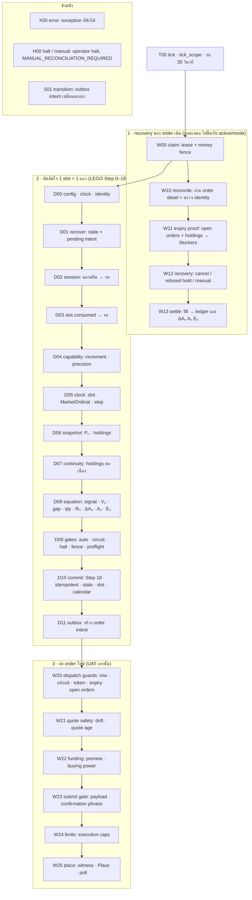

# Flight recorder — กล่องดำของ LEGO ใน Firebase

เป้าหมาย: ให้การ audit รอบหน้า "เห็นสดเหมือนอยู่ในเหตุการณ์" — อ่านจาก Firebase ได้ว่า tick นั้นเดินผ่านผัง LEGO จุดไหน
สมการใช้ค่าอะไร Webull ตอบอะไร (พร้อม request id) และเหตุผลที่ระบบเลือกทำ/ไม่ทำ โดยไม่ต้องเดาจาก Cloud Logging

สถานะ: **code-ready, live-evidence-pending** — เทสต์ในเครื่องผ่าน แต่ยังไม่เคยรันกับ RTDB/Webull จริง (ดู [ข้อจำกัด](#ข้อจำกัดที่ต้องรู้))

## ทำไมต้องมี

8 ตุลาคม 2026 order UAT ค้าง `PENDING` ถึงปิดตลาดแล้ว `cancel_expire` (DAY-expiry proof) ไม่ปล่อย order ตั้งแต่ 21:00Z ถึง 23:22Z
ก่อน hold 8 ชั่วโมงหมดและระบบ halt — แต่**ไม่มีหลักฐานใดบอกว่า proof ติดเงื่อนไขไหน**:

| ที่คาดว่าจะมีหลักฐาน | ความจริง |
|---|---|
| Cloud Logging | เหตุผลอยู่ใน `logger.info("lego expiry proof not met …")` ซึ่ง Cloud Logging ไม่รับ (0 จาก 1,860 tick มี `lego_order_worker actionable=`) |
| `lego_operation` | มีแค่ชื่อ phase + เวลา + outcome; ไม่มี request id, HTTP status หรือ error code |
| Firebase | intent ไม่เก็บ blocker; ไม่มีคำตอบของ Webull ใน database เลย |

## เก็บอะไร

หนึ่ง tick ที่ "น่าสนใจ" = หนึ่ง document ที่ private ใน RTDB รวม 4 อย่าง ด้วย **node id ชุดเดียวกัน** (`flight_recorder.NODES` = ผังด้านล่าง):

| เสา | อยู่ที่ไหนใน document | ตัวอย่างที่ตอบได้ |
|---|---|---|
| **ผัง LEGO** | `path` (เส้นทางที่ tick เดิน) + event `k:"n"` ต่อ node | `W00[claimed]>W10[PENDING]>W11[order_still_listed_open]>W12[CANCEL_UNKNOWN]` |
| **สมการ** | event `k:"eq"` — `D08` (ตัดสินใจ), `W13` (ตอน fill) พร้อม `in`/`out`/สูตร | Vₙ, gap, qty, Rₙ, ΔAₙ, Aₙ, Eₙ คำนวณซ้ำได้จากค่าที่บันทึก |
| **คำตอบ Webull** | event `k:"wb"` — route, ms, HTTP status, `X-Request-Id`, request/response ที่ sanitize+project, error code/ข้อความ | cancel → 417 `OPENAPI_ORDER_CANNOT_OPERATE` request id อะไร; open orders มี order นี้ไหม |
| **ทุกการกระทำรอบข้าง** | `ph` phase+เวลาเหลือ, `wn` warning, `tr` outbox transition (from→to), `er` exception ที่ดักได้, `H00` halt/manual | intent เปลี่ยนสถานะเมื่อไร ทำไม halt |

## ผัง LEGO (node catalog)



อ่าน `path`: `|` คั่น decision กับ worker, `[ ]` คือผลของ node นั้น (เช่น `D08[READY_BUY]`, `W11[holdings_changed]`); node ที่ไม่ถึงจะไม่อยู่ใน path —
ดังนั้น "tick หยุดตรงไหน" = node สุดท้ายใน path. test `test_flight_recorder_catalog_*` บังคับว่า node ในโค้ด = `NODES` = ผังนี้

## เก็บที่ไหน และเก็บเมื่อไร

| path (private: `.read`/`.write` = false) | เนื้อหา |
|---|---|
| `webull_lego_trace/{chain}/{YYYY-MM-DD}/{HHMMSS}_{tick8}` | document ของ tick (schema v1: `tick`, `at`, `http`, `pipe`, `biz`, `rev`, `cand`, `git`, `env`, `mode`, `chain`, `slot`, `step`, `runs`, `path`, `why`, `res`, `events`, …) |
| `webull_lego_heartbeat/{chain}` | tick ล่าสุด + ตัวนับตั้งแต่ instance boot (`ticks`, `written`, `skipped_dup`, `skipped_budget`, `write_errors`, `flush_timeouts`, `internal_errors`) + key ของ trace ล่าสุด |
| `webull_lego_trace_days/{chain}/{YYYY-MM-DD}` | ดัชนีวันสำหรับ retention |

**เขียนเมื่อ "น่าสนใจ" (`why`)**: มี Place/Cancel (`mutation`), Webull error, warning, exception, commit แถวใหม่ (`row_committed`), intent ที่ยังไม่จบ (`unresolved_intent`),
halt, tick ถูกเลื่อน (`deferred`), tick แรกของ instance (`boot` — มี snapshot ของ env ที่ไม่ลับ) — tick ว่าง (`MARKET_CLOSED`, `SLOT_CONSUMED`) ไม่เขียน
(Cloud Logging มีอยู่แล้ว). Tick ที่รอ intent เดิมโดยไม่มีอะไรใหม่ (signature เท่าเดิม) ข้ามได้ ≤15 นาที — order ค้างทั้งวันจึงได้ ≈100 document ไม่ใช่ 1,440.
Heartbeat เขียน ≤ทุก 5 นาที. หลัง Place/Cancel มี **checkpoint** (document `partial:true`) เพื่อไม่เสียหลักฐานถ้า instance ตายกลาง tick; ท้าย tick เขียนทับ key เดิม

**ตั้งค่า (env, อ่านตอนเรียก)**: `LEGO_TRACE_LEVEL` = `notable` (default) | `all` | `off` (ปิดสนิท); `LEGO_TRACE_BODIES` = `full` (default) | `min` (เก็บแค่ status/id/hash);
`LEGO_TRACE_RETENTION_DAYS` = 14 (prune วันที่เก่าสุดครั้งละหนึ่ง bucket ต่อชั่วโมง เมื่อ tick เหลือเวลา ≥10 วินาที)

**เพดาน**: event ≤6 KB, tick ≤96 KB และ ≤200 event (event สำคัญ — node/equation/error/transition/warning/mutation — มี headroom +25%; ที่ตัดทิ้งนับใน `dropped`).
ประมาณการ 0.5–1 MB/วัน — **ยังไม่ได้วัดจริง** (ดูข้อจำกัด)

## ความปลอดภัย (แต่ละข้อมีเทสต์ล็อก)

- **ไม่กระทบการเทรด**: ทุกฟังก์ชันของ recorder ไม่ raise, ไม่ print, ไม่แก้ argument, ไม่เปลี่ยน control flow; DB พัง/เวลาไม่พอ/flush ค้างไม่เปลี่ยนผลของ `lego_tick`
  (`test_a_recorder_that_cannot_write_never_changes_the_tick`, `test_a_recorder_failure_never_changes_what_the_broker_call_returns_or_raises`)
- **เขียนหลัง tick พร้อมตอบ**: หลัง `emit_tick`/`notify_tick`; time-box 3 วินาที (thread + join); ข้ามถ้างบเหลือ <12 วินาที (ไม่ชนเพดาน Cloud Run 45 วินาที)
- **Cloud Logging ยังไม่มี payload**: เพิ่มเฉพาะ `request_id`, `http_status`, `error_code` ที่ผ่าน regex ใน event `lego_operation` ของ `sdk_*`; payload อยู่ใน RTDB private เท่านั้น
- **ไม่มี credential/identity**: ผ่าน `security_text.trace_clean` — key ลับ (`account_id`, `app_key`, `x-signature`, token, …) และข้อความ free text ถูก redact; ไม่เก็บ header; `/auth/*` และ `/openapi/config` เก็บแค่ status
- **path สาธารณะได้แค่รหัส**: `webull_lego_warnings`/`rows`/`state`/`order_audit` อ่านได้โดยทุกคน จึงรับเฉพาะรหัส blocker + เวลา (ไม่มี holdings/open orders/ตัวเลข)
- **ไม่ลดความปลอดภัยของ money path**: ไม่แตะ recovery/halt/ledger/fence — เพิ่มเฉพาะการบันทึกและการ return `diag` จาก `_try_expiry_release`

## อ่านอย่างไร

**1) ตัว digest (ไม่เขียนอะไร ไม่เรียก broker; stdlib ล้วน)**

```bash
python -m tools.trace_audit --logs cloud-logs.json --rtdb rtdb-export.json --yaml service.yaml --repo .
python -m tools.trace_audit --rtdb rtdb-export.json --run d3859ea2          # เรื่องของ order เดียว
python -m tools.trace_audit --rtdb rtdb-export.json --json --fail-on P0      # สำหรับ script/CI
python -m tools.trace_audit --live [--follow] [--chain UBER_…]               # อ่านสดจาก Firebase (ต้องมี credential)
```

ส่วนของรายงาน: ข้อค้นพบ P0/P1/P2 พร้อมหลักฐาน · inputs (sha256) · ticks (HTTP/สถานะเป็นช่วง/gap/p50-p95/ช้าที่สุด) · ops และ Webull error (รวมบรรทัด error ที่ SDK เขียนเป็นข้อความ:
route, code, HTTP, request id) · **equations** (คำนวณซ้ำทุกแถว 17 คอลัมน์และทุก fill: Vₙ, gap, ขอบ DIFF, qty, Rₙ, ΔAₙ→Aₙ→Eₙ, โซ่ P_acted/A, position walk) ·
ledger (seq ต่อเนื่อง, finalized = applied, realized รวมถูก) · economics (fee/order, round trip, realized หลังหัก fee) · orders (timeline ต่อ order, halt, audit) ·
flight recorder (path, W11 blockers, ตาราง Webull exchange, transitions, สมการที่บันทึกคำนวณซ้ำ, สุขภาพ recorder) · deployment (env, cpu/timeout, window เหลือกี่วัน, ไม่มี alert, candidate hash เทียบ repo)
สูตรในตัว digest เป็นกระจกของ `lego_one_row.py` และมีเทสต์เทียบกับโค้ดจริงกว่า 2,600 กรณี

**2) อ่านมือใน Firebase console**: เปิด `webull_lego_trace/{chain}/{วัน}` เลือก key ล่าสุด → ดู `why` และ `path` ก่อน แล้วค่อยลง `events`:

```text
path  W00[claimed]>W10[PENDING]>W11[order_still_listed_open]>W12[CANCEL_UNKNOWN]>W13[CANCEL_UNKNOWN]
why   ["unresolved_intent","warning"]
W11   x: { blockers: ["order_still_listed_open"], open_orders: 1, listed: true, holdings: 8.0, decision_holdings: 8.0 }
wb    order_detail GET /trading/orders/get  st=200  rid=…  res.orders[0].order_status="PENDING"  fact={st:PENDING, fq:0, tq:1.09}
```

(ตัวอย่างมาจากเทสต์ replay ของ `test_incident_20261006` — ข้อมูลสังเคราะห์) intent ที่ค้างยังมี `expiry_proof_blockers` + `expiry_proof_checked_at` ติดอยู่ ดูได้จาก
`python ops.py status` และใน tick log (`execution[]`) โดยไม่ต้องเปิด trace

## ข้อจำกัดที่ต้องรู้

- **ยังไม่เคยรันกับ RTDB และ Webull จริง**: เทสต์ใช้ FAKE_DB และ SDK จริงจาก wheel ที่ vendor ไว้กับ transport ปลอม; ขนาด/ความหน่วงของการเขียนจริง (ประมาณ 0.5–1 MB/วัน, ≤3 วินาทีต่อ tick)
  ต้องวัดหลัง deploy — ดู `heartbeat.flush_timeouts`/`write_errors`
- **recorder เป็น best effort**: "ไม่มี trace" ไม่ได้แปลว่า "ไม่มีเหตุการณ์" (tick ที่ตายก่อน flush, ข้ามเพราะงบเวลา `skipped_budget`, หรือ dedup) — heartbeat บอกจำนวนที่ข้าม
- ผลของ SDK-internal retry เห็นเฉพาะผลสุดท้ายของ `get_response` (สิ่งที่ pipeline เห็นจริง)
- เก็บ response เฉพาะ symbol/order ที่เกี่ยวข้อง (positions/open orders ตัดส่วนอื่นทิ้งเก็บแค่ `count`)
- ความหมายของ `PENDING` หลังปิดตลาดและของ HTTP 417 ยังเป็นข้อสันนิษฐานจน Webull ยืนยัน (`developer.webull.co.th` เปิดจากสภาพแวดล้อมนี้ไม่ได้) — recorder เก็บ**หลักฐานของคำตอบ** ไม่ได้แปลความแทน
- ต้อง deploy revision ใหม่จึงเริ่มเก็บ; order ที่ค้างอยู่ก่อน deploy ไม่มี trace ย้อนหลัง (ใช้ `tools.resume_order_reconciliation --expiry-proof` แบบ read-only เพื่อได้ blocker ทันที)
