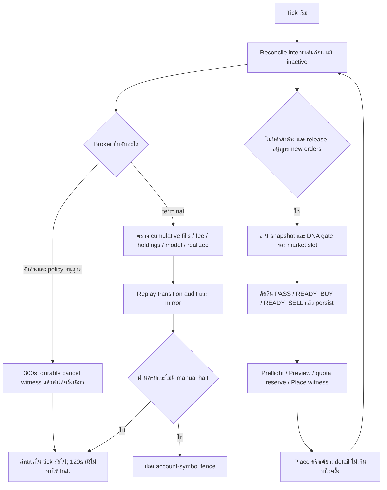

# คู่มือการศึกษา LEGO: decision, execution และการกู้คืน

โค้ดปัจจุบันใช้ Firebase RTDB, market-clock slots และ model ledger แบบ frozen จนยืนยัน execution terminal. Template เก่าที่กล่าวว่า Firestore, step เพิ่มจากจำนวนแถวเสมอ หรือบันทึกกำไรทุก decision ใช้อธิบายรุ่นนี้ไม่ได้.

DNA เป็น gate array 0/1 มีความยาวจำกัด. Market clock และ bundle origin/interval กำหนด index; เวลาที่ผ่านไปอาจกินหลาย slots แม้ไม่มีแถวใหม่. `bypass:500` เปิด gate ทุกช่อง 500 slots ไม่ใช่คำสั่งให้เทรด 500 ครั้ง และไม่วนกลับต้นเอง. ระบบเตือนเมื่อ remaining ไม่พอสอง sessions ถัดไป.

| ค่า | ความหมายตาม implementation |
|---|---|
| `V = holdings × P` | มูลค่าหุ้นจาก snapshot |
| `gap = V − FIX_C` | ค่าบวก = ถือเกินเป้า → ขาย (`READY_SELL` เมื่อ gap > DIFF); ค่าลบ = ถือขาด → ซื้อ (`READY_BUY` เมื่อ gap < −DIFF); คอลัมน์ "ส่วนต่างเป้าหมาย" เก็บค่านี้ (`lego_one_row.build_decision`; เอกสารรุ่นก่อนเขียนกลับเครื่องหมาย) |
| DNA signal 0 | PASS_DNA_ZERO |
| `abs(gap) <= DIFF` | PASS_THRESHOLD |
| Quantity | สร้างจาก gap/price ตาม precision และ lot/fractional guards ปัจจุบัน |
| `R_market = FIX_C × ln(P/P0)` | mark-to-market reference ไม่ใช่เงินสดจริง |
| Model terminal delta | `FIX_C × (fill_price / p_acted − 1)` หลัง terminal/holdings checks ผ่าน |
| Initial funding | model delta=0 และตั้ง execution baseline; มีเงินซื้อหุ้นจริงใน broker ledger |
| Broker cash BUY | `−cumulative_qty × average_fill_price − actual_fee` |
| Broker cash SELL | `+cumulative_qty × average_fill_price − actual_fee` |

Semantics ของ v2 strategy ปัจจุบันชื่อ `execution_terminal_funding_v3` ใน `ledger_v2.py`; recovery/release v4 ไม่เปลี่ยนสูตรนี้. Model `A/E/p_acted` ถูก freeze ระหว่าง PASS, decision, SUBMITTED และ partial non-terminal. Terminal ใช้ `R_basis` ที่บันทึกกับ decision. Broker ledger รับ cumulative delta แยกต่างหาก จึงไม่ถือ model A เป็น cash balance หรือ buying power.

ตัวอย่าง ซื้อเริ่มต้น 1 หุ้น ราคา 70 USD และ fee 0.10: broker cash delta = −70.10 แต่ initial-funding model delta = 0. ถ้า response เดิมมาซ้ำ delta ใหม่เป็น 0. ถ้า fee ตามมาภายหลัง เพิ่มเฉพาะ fee delta. เมื่อ cancel หลังซื้อได้บางส่วน ต้องใช้จำนวนที่ fill จริง ไม่ใช้จำนวนที่ขอส่ง.

READY_BUY หมายถึง decision ให้ซื้อ. SUBMITTED หมายถึง broker รับ/กำลังจัดการคำสั่ง. FILLED ต้องมีปริมาณ/ราคาและหลักฐานบัญชีครบก่อนถือว่าปิดงาน. `CANCEL_REQUESTED`/`CANCEL_UNKNOWN` ไม่ใช่ terminal. HTTP 200 บอกว่า Scheduler request ได้รับการตอบ ไม่ได้บอกว่าการเทรดปกติ; ดู business_status และ operational_health.

หลักฐานเดิม 430 ticks มี 394 overdue, 16 waiting, 14 slot consumed, 4 market closed, 1 row committed และ 1 error. 26 intents เป็น 24 EXPIRED_UNSENT, 1 SUPPRESSED_STATE_CHANGED, 1 CANCELLED และไม่มี positive fill. HTTP 503 เวลา 13:45:32 มาก่อน placed_at 13:46:23 จึงยังสรุป phase ต้นเหตุไม่ได้. Fractional capability ของ UBER ไม่ได้พิสูจน์ว่าสาเหตุการค้างคือ fractional และ 503 ไม่ได้พิสูจน์ Scheduler retry/duplicate order.

คิดง่าย ๆ: fence คือป้ายว่าเงินของคำสั่งนี้ยังตรวจไม่ครบ. เวลาผ่านไปหรือได้รับคำตอบว่า “รับคำขอยกเลิกแล้ว” ไม่ทำให้ป้ายนั้นหาย. ปลดได้เมื่อ broker จบงานจริงและบัญชี/audit ผ่าน. เมื่อไม่แน่ใจ ระบบหยุด new orders และให้ผู้ดูแลตรวจ แทนการสั่งซ้ำ.

ตรวจความเข้าใจ: (1) zero-fill cancel ทำให้ cashflow เปลี่ยนหรือไม่? ไม่. (2) เปลี่ยน release วันเดิมคืน quota หรือไม่? ไม่ใน market_day mode. (3) inactive หยุดอ่านคำสั่งเดิมหรือไม่? ไม่. (4) มี Secret Manager แล้วไม่ต้องยืนยัน token อีกหรือไม่? ยังอาจต้องยืนยันตาม Webull lifecycle. (5) mock tests ผ่านถือว่าพร้อมเงินจริงหรือไม่? ไม่ ต้องผ่าน UAT positive-fill endurance และ PROD observe gates ก่อน.

วิธีปฏิบัติและ config: [CONTINUOUS_RELEASE_V4_TH.md](CONTINUOUS_RELEASE_V4_TH.md). ผลส่งมอบและข้อจำกัด: [implementation_plan_review.md](implementation_plan_review.md).
